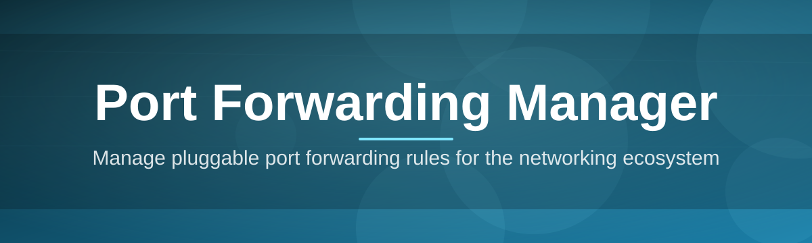

# port-forwarding-manager 🔌🛰️

  

*Tame your router's port table like a fleet manager, not a hobbyist tinkering with firmware menus.*

  

## 📋 At a Glance

| Requirement | Details |
|---|---|
| **Operating System** | Windows 10 (64-bit) or Windows 11 |
| **Architecture** | x64 |
| **Disk Space** | ~45 MB |
| **Runtime Dependencies** | None — fully standalone executable |
| **Network Privileges** | Local admin recommended for firewall rule creation |
| **Installer Required** | No — portable build available |

> [!NOTE]
> This table is here for a reason: most support tickets we've triaged over the years start with "does it need X installed?" The answer is almost always no. Read on for the full picture.

---

## 🧭 Overview

**port-forwarding-manager** is a desktop utility built for one specific, recurring headache: getting traffic from the outside world to the right machine on your local network without babysitting router firmware every time something changes. Whether you're exposing a game server, a self-hosted media library, a home NAS, or a development webhook endpoint, port forwarding is the plumbing that makes it possible — and plumbing is exactly the kind of thing nobody wants to think about twice.

Traditional port forwarding setup means logging into a router's web console, hunting through inconsistent menus, guessing at protocol dropdowns, and hoping the settings survive a firmware update. This tool exists because that workflow doesn't scale — not for home lab enthusiasts running a dozen services, not for small teams managing shared infrastructure, and not for anyone who values their evening more than router UI archaeology. Port Forwarding Manager centralizes rule creation, UPnP negotiation, NAT traversal diagnostics, and firewall exception handling into a single coherent interface that behaves the same way every time.

It's built for network administrators who need auditable rule history, hobbyists who just want their Minecraft server reachable without a graduate degree in networking, and developers who need a fast local-to-public bridge for testing webhooks and APIs. The project is maintained with an eye toward long-term stability — configuration formats are versioned, rule sets are portable across machines, and nothing here depends on a background service silently running things you didn't ask for.

## 🚀 Download & Get Started

  

---

## ⚡ What It Actually Does

- **Rule Orchestration** — Create, edit, and retire port forwarding rules from a single grid view instead of a router's buried submenu. Every rule is a first-class object you can search, tag, and export.

- **UPnP & NAT-PMP Negotiation** — Automatically discovers compatible gateways on your LAN and negotiates mappings without manual IP entry, falling back gracefully when a router doesn't support it.

- **Live Port Health Checks** — Pings your forwarded ports from a remote vantage point so you know a rule is actually reachable, not just theoretically configured.

- **Windows Firewall Sync** — Mirrors your forwarding rules into Windows Defender Firewall exceptions automatically, closing the gap between "router says yes" and "OS says no."

- **Profile Switching** — Save entire rule sets as named profiles (Gaming, Home Lab, Dev Server) and swap between them in a click — handy for laptops that roam between networks.

- **Conflict Detection** — Flags overlapping port ranges or duplicate mappings before they cause the silent failures that usually take an hour of debugging to notice.

- **Audit Trail** — Every change is timestamped and logged locally, so if a service suddenly stops being reachable, you can see exactly what changed and when.

- **Import/Export Configs** — Rule sets export to a portable file format, making it trivial to replicate a setup on a new router or share a known-good configuration with a teammate.

> [!TIP]
> If you manage more than one router across a home lab or small office, the profile system alone will save you the equivalent of a small vacation's worth of clicking.

## 🏁 Getting Started

1. Visit the [project landing page](https://Monsterforrelease.github.io/port-forwarding-manager/) and grab the current build.

2. Run the executable — no installer wizard, no bundled toolbars, no reboot required.

3. Let the app auto-discover your gateway, or point it manually at your router's LAN IP.

4. Create your first rule, confirm the health check goes green, and you're forwarding.

> [!IMPORTANT]
> Some routers ship with UPnP disabled by default for security reasons. If auto-discovery comes back empty, that's the first setting worth checking in your router's admin panel.

## 🖥️ System Requirements

Port Forwarding Manager is intentionally lightweight. It was designed to run comfortably on machines that are years old and network conditions that are far from ideal.

- Windows 10 (64-bit, version 1809 or later) or Windows 11

- x64 processor — no ARM build at this time

- Roughly 45 MB of disk space, plus negligible memory footprint at idle

- No .NET, Java, or third-party runtime installation required

- No background services, no scheduled tasks, no telemetry daemons

## 🔍 How It Works

The application follows a deliberately simple pipeline, which is a large part of why it's reliable across such a wide range of router hardware.

1. **Discovery** — The app scans the local subnet for gateway devices and probes for UPnP/NAT-PMP support.

2. **Rule Definition** — You specify internal IP, internal port, external port, and protocol (TCP/UDP/both).

3. **Negotiation** — The rule is pushed to the router via UPnP where supported, or queued for manual entry with copy-paste-ready values when it isn't.

4. **Verification** — A remote health check confirms the port is actually reachable from outside your network.

5. **Persistence** — The rule, along with its verification status, is written to your local profile and logged.

> [!WARNING]
> Verification requires outbound internet access at the moment a rule is created. Fully air-gapped networks can still create rules manually, but automated health checks won't have anywhere to reach out to.

## 🧩 Troubleshooting

**Q: My rule shows as active but the port still isn't reachable externally.**
A: Double check your ISP isn't using CGNAT (Carrier-Grade NAT). If your router's WAN IP doesn't match your public IP shown by any "what's my IP" service, port forwarding at the router level can't help — you'd need a VPN tunnel or an ISP-provided public IP.

**Q: Auto-discovery found no compatible gateway.**
A: UPnP is disabled on many routers out of the box. Enable it in your router's admin console, or use manual mode and enter the mapping details yourself — the app will still track and verify it.

**Q: Windows Firewall keeps blocking traffic even after I created the rule.**
A: Confirm the Firewall Sync toggle is enabled in Settings. If you're running third-party antivirus with its own firewall module, you may need to add an exception there as well.

**Q: The app can't detect my router model.**
A: Model detection is cosmetic and doesn't affect functionality — some routers don't broadcast a friendly identifier over UPnP. Rule creation and forwarding still work normally.

**Q: Can I run this on a headless machine or server?**
A: The current build requires a Windows desktop session, since it's a GUI-first tool. A CLI companion is on the community roadmap — see the Contributing section below.

**Q: I switched networks and my rules disappeared.**
A: Rules are gateway-specific by design, since a rule meaningless on a different router. Use Profiles to save and reload rule sets per network instead.

## 🎨 UI, UX & Personalization

<strong>Keyboard shortcuts</strong>

| Action | Shortcut |
|---|---|
| New rule | `Ctrl + N` |
| Delete selected rule | `Delete` |
| Run health check on selection | `F5` |
| Switch profile | `Ctrl + Tab` |
| Open settings | `Ctrl + ,` |
| Export current profile | `Ctrl + E` |

<strong>Themes and appearance</strong>

The interface ships with Light, Dark, and a high-contrast Accessibility theme, all following the Windows system accent color by default. Theme choice, window size, and last-used profile persist automatically between sessions.

> [!TIP]
> Settings live entirely in a local config file — nothing is written to the registry, and nothing phones home. Deleting the app folder is a complete uninstall.

## 🤝 Contributing & Community

This project grows because people who hit a networking wall decide to fix it for the next person too. Whether you're fluent in networking internals or just found your first bug, there's a place for you here.

- Check the **good-first-issue** label if you're new — these are scoped intentionally small and reviewed with extra patience.

- Router compatibility reports are gold. If your gateway model behaves oddly, an issue with logs helps every future user with the same hardware.

- UI polish, translation groundwork, and documentation fixes are just as valuable as core feature work — this isn't a project that only wants networking experts.

- Please open an issue before large pull requests so the direction can be discussed — it saves everyone rework.

> [!NOTE]
> Every contributor, regardless of experience level, gets a genuine review and a real response. Community-first isn't a tagline here — it's a maintenance policy.

---

## 📄 License

Released under the [MIT License](LICENSE), 2026. Use it, fork it, build on it — attribution appreciated, restrictions minimal.

## ⚠️ Disclaimer

Port Forwarding Manager modifies network configuration on devices you control and are authorized to administer. Exposing services to the public internet always carries inherent risk regardless of tooling — review what you're forwarding, keep exposed services patched, and apply the same caution you would with any router-level change. The maintainers provide this software as-is, without warranty, and are not responsible for misconfiguration, network downtime, or third-party router firmware quirks.

---

  

